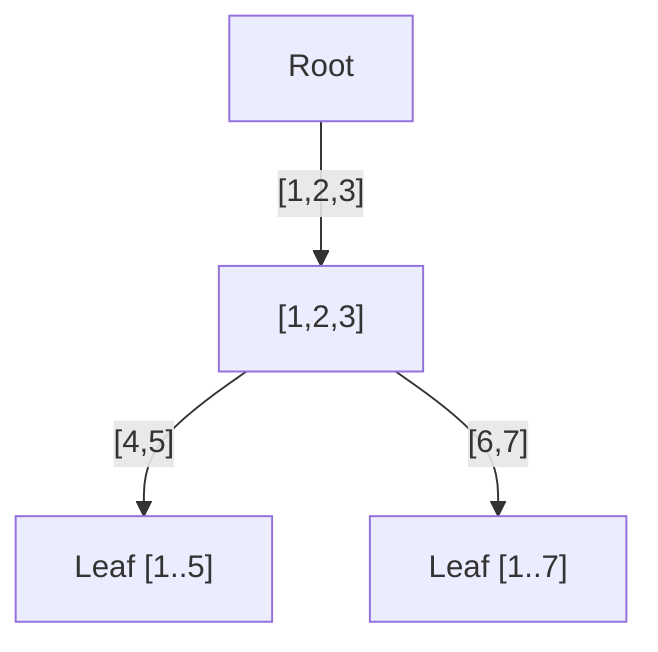
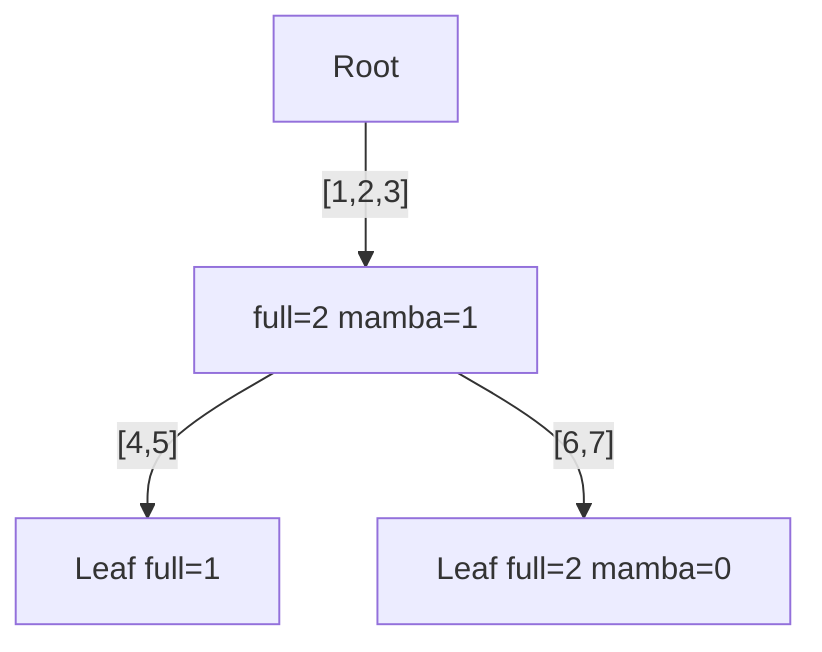
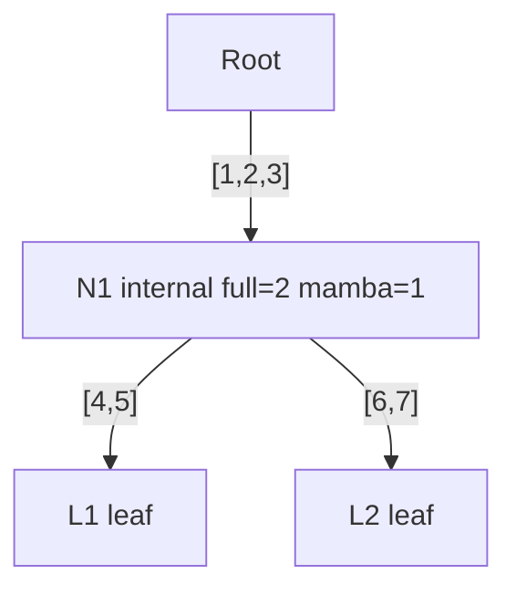
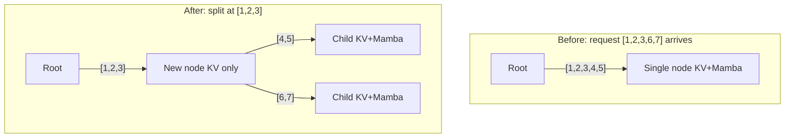
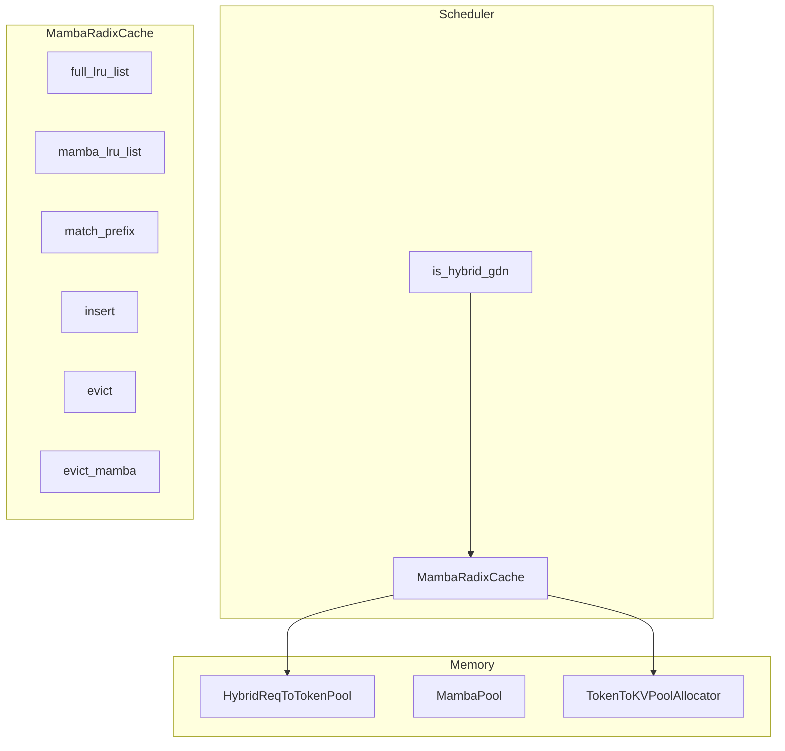

# Mamba Radix Cache Implementation in SGLang

This document explains how [SGLang](https://github.com/sgl-project/sglang) implements prefix caching for hybrid (Mamba + Transformer) models via [PR #11214](https://github.com/sgl-project/sglang/pull/11214). It first establishes the **theory and concepts** that drive the design, then maps them to the code.

---

## Table of Contents

1. [Theory and Concepts](#1-theory-and-concepts)
2. [Architecture Overview](#2-architecture-overview)
3. [Implementation: Key Components](#3-implementation-key-components)
4. [Implementation: Match and Insert](#4-implementation-match-and-insert)
5. [Implementation: Eviction](#5-implementation-eviction)
6. [Memory Management and Server Args](#6-memory-management-and-server-args)
7. [Model Detection and Integration](#7-model-detection-and-integration)
8. [Relation to Marconi](#8-relation-to-marconi)

---

## 1. Theory and Concepts

This section defines the core concepts and design rationale before any code reference. Read this first; the implementation sections (§3–5) map these concepts to the code.

### 1.1 Motivation: Why Hybrid Models Need Special Handling

As explained in the [SGLang overview](01-sglang-overview.md#32-hybrid-models-mamba--transformer):

- **Attention KV cache**: Can be **sliced**—if you have KVs for tokens 1..100, you can reuse KVs for tokens 1..80 by truncation.
- **Mamba (SSM) state**: Updated **in-place**—the state at token 100 cannot be "rolled back" to represent token 80.

**Implication**: Mamba states require **exact-match** cache hits. The radix cache must store both KV and Mamba state per node, with **separate eviction paths** because each has different semantics.

### 1.2 The Radix Tree

A **radix tree** (prefix tree) organizes cached sequences by prefix overlap:

- **Nodes**: Each node represents a contiguous span of tokens. A path from root to leaf = one complete cached sequence.
- **Edges**: Labeled by token sequences. Shared prefixes share nodes and edges.
- **Purpose**: When a new request arrives, we traverse the tree to find the **longest matching prefix** and reuse its cached state instead of recomputing.



### 1.3 Dual State: KV vs Mamba

Each node conceptually holds two kinds of state:

| State | Layer | Semantics | Can be split? |
|-------|-------|-----------|---------------|
| **KV** | Attention | Key-value pairs per token; grows with sequence length | Yes (truncate) |
| **Mamba** | SSM | Single fixed-size recurrent state for the entire sequence up to this node | No |

**Why both?** A prefix hit is valid only if **both** Attention and Mamba can reuse. If we have KVs for tokens 1..80 but Mamba only for 1..100, we cannot reuse—Mamba cannot be rolled back.

### 1.4 Reference Counting (Locks)

**Problem**: Multiple in-flight requests may share the same cached prefix. We must not evict a node while any request is still using it.

**Solution**: **Reference counting** per node. When a request starts using a prefix:

- **Increment** the count for each node on the path (and for the Mamba state at the match node).
- When the request finishes, **decrement** the count.
- Only evict nodes whose count is zero.

**Two counts**:

- **Full lock** (path): Protects the KV path from this node to the root. Used by any request that reads KV along this path.
- **Mamba lock**: Protects the Mamba state at this node. Used when a request copies the Mamba state to continue decoding.

**Invariant**: If Mamba is locked, the path must be locked too (you cannot use Mamba without the path). So `full_lock_ref >= mamba_lock_ref`.



### 1.5 Copy-on-Write for Mamba

**Problem**: The cached Mamba state is shared. When a request hits a prefix and continues decoding, it will **modify** the Mamba state (in-place). We cannot let multiple requests mutate the same cached state.

**Solution**: **Copy-on-write (CoW)**. On a prefix hit:

1. Allocate a **private slot** for the request in the Mamba pool.
2. **Copy** the cached Mamba state into that slot.
3. The request uses its private copy for all subsequent decoding.

The cache entry remains unchanged; the request gets its own copy. This is the `cow_mamba` flow.

### 1.6 Tombstones

**Problem**: Mamba state is fixed-size and expensive. When we evict Mamba from an **internal** node (one with children), we free memory but the node's **children** still need the KV path to the root. So we cannot delete the node.

**Solution**: **Tombstone**—an internal node with `mamba_value = None` but KV still present. It holds the KV for its children; only the Mamba state is freed.

**Why internal nodes can be tombstones**: Mamba eviction can target any node. For internal nodes, we free Mamba and leave the KV intact; the node becomes a tombstone. For leaf nodes, we free both and delete the node.

### 1.7 Dual Eviction Paths

**Why two eviction paths?**

- **KV eviction**: Must free **whole paths** (root to leaf). KV is stored per token along the path; we cannot free partial paths without breaking the tree. So we evict **leaf nodes** only.
- **Mamba eviction**: Can free **individual nodes**. Each node has one Mamba state; we can free it without touching children. So we can evict **any node** (leaf or internal). Internal nodes become tombstones.

**Result**: Two LRU lists—one for full (KV) eviction (leaf-only), one for Mamba eviction (any node).

The tree below illustrates locks (§1.4), tombstones (§1.6), and eviction targets (§1.7) on the same structure. **Full eviction**: must pick a leaf (L1 or L2)—whole path freed. **Mamba eviction**: can pick N1 (internal → tombstone, KV kept for children) or a leaf (→ delete).



### 1.8 Node Splitting

**Problem**: A new request may match only a **prefix** of an existing edge. E.g., we have cached [1,2,3,4,5] and a new request arrives with [1,2,3,6,7].

**Solution**: **Split** the node. Create a new node for [1,2,3], make [4,5] and [6,7] its children. The new node gets KV for [1,2,3], but **no Mamba**—Mamba cannot represent a partial sequence; we only have Mamba at the end of [1,2,3,4,5] and [1,2,3,6,7].



### 1.9 Summary: Key Terms

| Term | Definition |
|------|------------|
| **Radix tree** | Prefix tree mapping token sequences to cached state; shared prefixes share nodes |
| **Full lock** | Reference count protecting the KV path from a node to the root; prevents eviction while in use |
| **Mamba lock** | Reference count protecting the Mamba state at a node; implies full lock on path |
| **Copy-on-write (CoW)** | On prefix hit, copy cached Mamba state into request's private slot so decoding can mutate it safely |
| **Tombstone** | Internal node with Mamba freed but KV retained; holds path for children |
| **Full eviction** | Evict leaf nodes to free KV paths; must free whole paths |
| **Mamba eviction** | Evict any node to free Mamba slots; internal nodes become tombstones |

---

## 2. Architecture Overview



When `is_hybrid_gdn` is true (Gated Delta Network / Mamba2-style hybrid models), the scheduler uses `MambaRadixCache` instead of the standard `RadixCache`. The cache coordinates with `HybridReqToTokenPool` (which has a separate `MambaPool`) and `TokenToKVPoolAllocator` for KV storage.

---

## 3. Implementation: Key Components

### 3.1 File Locations (SGLang Repository)

| Component | Path | Description |
|-----------|------|-------------|
| **MambaRadixCache** | `python/sglang/srt/mem_cache/mamba_radix_cache.py` | Radix tree for hybrid KV + Mamba state |
| **TreeNode** | `mamba_radix_cache.py` | Node with `value` (KV), `mamba_value` (Mamba), lock refs |
| **LRUList** | `mamba_radix_cache.py` | Dual LRU: full (KV) and mamba |
| **HybridReqToTokenPool** | `python/sglang/srt/mem_cache/memory_pool.py` | Req pool with `mamba_size` and `MambaPool` |
| **Scheduler integration** | `python/sglang/srt/managers/scheduler.py` | `is_hybrid_gdn` → `MambaRadixCache` |
| **Schedule batch** | `python/sglang/srt/managers/schedule_batch.py` | `match_prefix` with `cow_mamba`, `alloc_req_slots` eviction |
| **Model runner** | `python/sglang/srt/model_executor/model_runner.py` | Memory allocation, `handle_max_mamba_cache` |

### 3.2 TreeNode: Mapping Theory to Fields

| Field | Theory | Implementation |
|-------|--------|----------------|
| `value` | KV indices for tokens on this edge | `torch.Tensor` of KV pool indices |
| `mamba_value` | Mamba state for this node | `torch.Tensor` of Mamba pool indices (or `None` for tombstone) |
| `full_lock_ref` | Reference count for KV path (node to root) | `int`; when > 0, path is in use |
| `mamba_lock_ref` | Reference count for Mamba state at this node | `int`; when > 0, Mamba is in use |
| `prev`, `next` | LRU ordering for full (KV) eviction | Doubly linked list |
| `mamba_prev`, `mamba_next` | LRU ordering for Mamba eviction | Doubly linked list |

**Invariant**: `full_lock_ref >= mamba_lock_ref`. Locking Mamba implies locking the path.

### 3.3 LRUList: Dual Eviction Ordering

Two `LRUList` instances:

- **full_lru_list**: For KV eviction. Evicts **leaf nodes** only (so full paths are freed).
- **mamba_lru_list**: For Mamba eviction. Can evict **any node** (leaf or internal). Internal nodes become tombstones.

Key methods:
- `get_lru_no_lock()`: LRU node with no lock (any node for mamba).
- `get_leaf_lru_no_lock()`: LRU leaf with no lock (for full KV eviction).
- `reset_node_mru(node)`: Move node to most recently used.
- `reset_node_and_parents_mru(node, root)`: Move node and ancestors to MRU (used on prefix match).

---

## 4. Implementation: Match and Insert

### 4.1 match_prefix: Theory Then Code

**Theory**: On a new request, we (1) find the longest matching prefix in the tree, (2) split nodes if the match ends mid-edge, (3) copy the cached Mamba state into the request's private slot (CoW), (4) mark the matched path as recently used (LRU update).

**Code flow** (when `schedule_batch` calls `match_prefix` with `cow_mamba=True`):

1. **Traverse** radix tree via `_match_prefix_helper` to find longest matching prefix.
2. **Split nodes** if match terminates mid-edge (e.g., match 80 of 100 tokens). New node gets KV slice; `mamba_value = None` (Mamba cannot be split—see §1.8).
3. **Copy-on-write Mamba** (§1.5): If `last_node.mamba_value` exists and `cow_mamba=True`:
   - Alloc slot in `mamba_pool` for the request.
   - If pool full: `evict_mamba(1)`, then retry.
   - `mamba_pool.copy_from(src_index, dst_index)` copies cached Mamba state to request's slot.
   - Set `req.mamba_pool_idx = dst_index`.
4. **Update LRU**: `reset_node_and_parents_mru(best_last_node, root)` so matched path is MRU.
5. **Return** `MatchResult(device_indices=value, last_device_node=last_node, ...)`.

### 4.2 insert and Caching: Theory Then Code

**Theory**: When a request finishes (or is partially prefetched), we insert its KV and Mamba state into the tree. We increment lock refs when a request starts using a prefix and decrement when it finishes.

**cache_finished_req** (request completed):

- Token IDs = `input_ids + output_ids[:-1]`.
- Get `mamba_value` from `req_to_token_pool.get_mamba_indices(req.req_pool_idx)`.
- Call `insert(RadixKey(...), kv_indices, mamba_value)`.
- Free overlapped KV indices, free req pool slot, `dec_lock_ref(req.last_node)` (§1.4).

**cache_unfinished_req** (chunked prefill, request not done):

- `mamba_value_forked = mamba_pool.fork_from(mamba_value)` to copy request's Mamba state into radix tree.
- If alloc fails: `evict_mamba(1)`, retry.
- Insert into tree; if node already had mamba, free forked copy.
- Update `req.prefix_indices`, `req.last_node`, lock refs.

### 4.3 Node Splitting and Tombstones in Code

When a match splits a node (e.g., need prefix of 80 tokens from a 100-token edge):

- **New parent node**: Gets first 80 tokens' KV; `mamba_value = None` (Mamba cannot represent partial sequence—§1.8).
- **Child node**: Keeps remaining 20 tokens' KV and original `mamba_value`.

Internal nodes with `mamba_value = None` are **tombstones** (§1.6)—they hold KV for children but no Mamba state. Mamba eviction can free Mamba from internal nodes, turning them into tombstones.

---

## 5. Implementation: Eviction

### 5.1 Eviction Theory (Dual Paths)

As established in §1.7:

- **KV eviction**: Must free whole paths; evict **leaf nodes** only. Each eviction frees the full path from root to that leaf.
- **Mamba eviction**: Can free individual nodes; evict **any node**. Internal nodes become tombstones; leaf nodes are fully deleted.

**Current policy**: PR #11214 uses **LRU** for both paths. No FLOP-aware policy yet (see [Marconi Integration](03-marconi-integration.md)).

### 5.2 evict_mamba: Code

**evict_mamba(mamba_num)**:

1. Get LRU node (any node, not necessarily leaf) with `mamba_lru_list.get_lru_no_lock()`—only nodes with `mamba_lock_ref == 0` are eligible (§1.4).
2. While `mamba_num_evicted < mamba_num`:
   - **Internal node**: Free `mamba_value`, remove from mamba LRU, tombstone the node (§1.6).
   - **Leaf node**: Call `_evict_leaf_node` (free KV + Mamba, delete node).
3. Iteratively delete tombstone leaves whose parents have no other children (cleanup).

### 5.3 evict (Full KV): Code

**evict(full_num_tokens)**:

1. Get LRU **leaf** with `full_lru_list.get_leaf_lru_no_lock()`—only leaf nodes with `full_lock_ref == 0`.
2. Evict leaf nodes until `full_num_evicted >= full_num_tokens`.
3. After each eviction, if parent becomes childless, get next LRU leaf.

### 5.4 Proactive Eviction: alloc_req_slots

**Theory**: When allocating slots for new requests, the Mamba pool may be full. We proactively evict Mamba entries before allocation.

**Code** (`schedule_batch.alloc_req_slots`):

```python
if isinstance(self.req_to_token_pool, HybridReqToTokenPool):
    mamba_available_size = self.req_to_token_pool.mamba_pool.available_size()
    if mamba_available_size < num_reqs:
        if isinstance(self.tree_cache, MambaRadixCache):
            mamba_num = max(0, num_reqs - mamba_available_size)
            self.tree_cache.evict_mamba(mamba_num)
```

Mamba eviction is triggered when the Mamba pool cannot satisfy the requested number of slots.

---

## 6. Memory Management and Server Args

### 6.1 Theory: Why Separate Pools?

KV and Mamba have different allocation patterns: KV grows with sequence length; Mamba is fixed-size per node. Separate pools allow independent eviction and sizing. The `--mamba-full-memory-ratio` controls how much memory is reserved for Mamba vs KV.

### 6.2 MambaPool (Implementation)

- **Location**: `memory_pool.py` (inside `HybridReqToTokenPool`).
- **Allocation**: `mamba_cache` holds conv and temporal (SSM) state; `free_slots` is a `torch.Tensor` of available indices.
- **Operations**: `alloc(need_size)`, `free(free_index)`, `copy_from(src, dst)`, `fork_from(src)` (alloc + copy).

### 6.3 Memory Ratio

- **`--mamba-full-memory-ratio`** (default `0.2`): Ratio of Mamba state memory to full KV cache memory.
- **Formula**: `mamba_state_memory = total_rest_memory * ratio / (1 + ratio)`.
- **max_mamba_cache_size**: Derived from `mamba_cache_per_req` and the allocated Mamba memory.

See [model_runner.py](https://github.com/sgl-project/sglang/blob/main/python/sglang/srt/model_executor/model_runner.py) `handle_max_mamba_cache` for the exact logic.

### 6.4 MAMBA_CACHE_SIZE_MAX_RUNNING_REQUESTS_RATIO

When radix cache is enabled, `max_num_reqs` is capped by `max_mamba_cache_size // 3` (ratio 3) to ensure enough Mamba slots for cache and in-flight requests.

---

## 7. Model Detection and Integration

### 7.1 hybrid_gdn_config vs mamba2_config

- **hybrid_gdn_config**: Gated Delta Network / Mamba2-style models (e.g., Qwen3-Next). Enables `MambaRadixCache`.
- **mamba2_config** (legacy): Disables radix cache (original behavior).

The PR changes model detection so that GDN-style hybrids use the new radix cache instead of disabling it.

### 7.2 Scheduler Branch

In `scheduler.py`:

```python
elif self.is_hybrid_gdn:
    assert server_args.disaggregation_mode == "null"
    self.tree_cache = MambaRadixCache(
        req_to_token_pool=self.req_to_token_pool,
        token_to_kv_pool_allocator=self.token_to_kv_pool_allocator,
        page_size=self.page_size,
        disable=server_args.disable_radix_cache,
    )
```

### 7.3 Page Size

**Current limitation**: `page_size == 1` only. The PR asserts this; `page_size > 1` is planned for a future update.

---

## 8. Relation to Marconi

The [Marconi paper](https://arxiv.org/abs/2411.19379) proposes:

1. **Judicious admission**: Cache SSM states only at branch points and last decoded token (not every token block).
2. **FLOP-aware eviction**: Score = `recency + α * flop_efficiency`; evict lowest score.

PR #11214 implements:

- **Admission**: All tokens (like vLLM+), not judicious.
- **Eviction**: LRU only.

To integrate Marconi's strategy, see [Marconi Integration](03-marconi-integration.md) for the integration plan, FLOP formulas, and test design.

---

## Further Reading

| Resource | Link |
|----------|------|
| PR #11214 | [github.com/sgl-project/sglang/pull/11214](https://github.com/sgl-project/sglang/pull/11214) |
| SGLang overview | [01-sglang-overview.md](01-sglang-overview.md) |
| Marconi integration | [03-marconi-integration.md](03-marconi-integration.md) |
| Marconi paper | [arXiv:2411.19379](https://arxiv.org/abs/2411.19379) |
| SGLang docs | [docs.sglang.io](https://docs.sglang.io/) |
