# Trace Generator & Replayer — Deep Dive

## What Are We Simulating and Why?

The [Marconi paper](https://arxiv.org/pdf/2411.19379) proposes a **FLOP-aware prefix caching** strategy for LLM inference servers. To prove it works, you need to reproduce **realistic multi-turn conversation workloads** against a live server and measure metrics like TTFT, cache hit rates, and throughput. That's the role of these two files:


1. **[generate_trace.py](file:///Users/megh/nyu/research/mlsys-marconi/marconi/utils/generate_trace.py)** converts real conversation datasets into deterministic, **pre-tokenized request traces** (JSONL files).
2. **[trace_replayer.py](file:///Users/megh/nyu/research/mlsys-marconi/src/trace_replayer.py)** replays those traces against a live SGLang server, respecting request timing, and collects performance metrics.

This two-stage design decouples **workload definition** from **server benchmarking** — you generate traces once and replay them against different server configs (baseline vs. Marconi) for apples-to-apples comparison.

---

## Part 1: The Trace Generator ([generate_trace.py](file:///Users/megh/nyu/research/mlsys-marconi/marconi/utils/generate_trace.py))

### What It Does

Converts real multi-turn conversation datasets into JSONL trace files where each line is one pre-tokenized LLM request. It simulates the **request arrival pattern** of many users chatting with an LLM concurrently.

### Key Parameter: `sessions_per_second` (sps)

This is the **arrival rate** — how many new conversation sessions start per second. It controls load intensity:

| sps | Meaning | Effect on Cache |
|-----|---------|-----------------|
| 0.25 | 1 new user every 4 sec | Low load, lots of time for KV reuse within a session |
| 1 | 1 new user per second | Moderate load |
| 10 | 10 new users per second | High load, sessions interleave heavily — more cache pressure |

### Datasets Supported

| Dataset | Source | Use Case |
|---------|--------|----------|
| **LMSys** | `lmsys/lmsys-chat-1m` | General chatbot (ChatGPT-style) |
| **ShareGPT** | `anon8231489123/ShareGPT_Vicuna_unfiltered` | Shared ChatGPT conversations |
| **SWE-Bench** | `nebius/SWE-agent-trajectories` | Code agent sessions (long-context, observation-collapsing) |
| **WildChat** | `allenai/WildChat-1M` | Diverse real-world chat |

### How a Trace Is Generated (LMSys example)

For each **session** (conversation):

1. **Assign a start time**: `curr_ts = session_id / sps` — sessions begin at staggered intervals
2. For each **turn** in the conversation:
   - Tokenize the user input and LLM output using the Llama-2 tokenizer
   - Compute `input_tokens` = **full conversation history** + current user input (this is the multi-turn prefix-growing pattern that Marconi exploits)
   - Simulate **inter-turn delay** based on typing speed (90 WPM default) — the time a user takes to type the next message
   - Skip if total tokens exceed 8192
3. After all sessions are processed, **sort all requests globally by timestamp** — this interleaves requests from different sessions chronologically
4. Write to JSONL

### What a Trace Line Looks Like

```json
{
  "session_id": 42,
  "turn_id": 3,
  "ts": 28.5,
  "num_input_tokens": 1847,
  "num_output_tokens": 256,
  "input_tokens": [1, 3907, 29871, ...],
  "output_tokens": [450, 29892, ...]
}
```

| Field | Meaning |
|-------|---------|
| `session_id` | Identifies the conversation session |
| `turn_id` | Which turn within the session (0 = first) |
| [ts](file:///Users/megh/nyu/research/mlsys-marconi/src/trace_replayer.py#557-566) | When this request should be sent (seconds from trace start) |
| `num_input_tokens` | Count of `input_tokens` (history + current input) |
| `num_output_tokens` | Count of `output_tokens` (what the LLM originally produced) |
| `input_tokens` | Full token ID array — grows each turn as history accumulates |
| `output_tokens` | LLM response token IDs (used to cap `max_tokens` during replay) |

### Why This Matters for Marconi

The **critical pattern** is that `input_tokens` for turn N includes **all previous turns**. This means:

```
Turn 0: [user_0]
Turn 1: [user_0, llm_0, user_1]
Turn 2: [user_0, llm_0, user_1, llm_1, user_2]
Turn 3: [user_0, llm_0, user_1, llm_1, user_2, llm_2, user_3]
```

Each request shares a **growing prefix** with its predecessors in the same session. A good prefix cache should recognize that turn 3 shares most of its input with turn 2, and reuse the cached KV states. **Marconi's FLOP-aware eviction** decides *which* of these prefixes to keep when memory is limited.

### SWE-Bench: Special Handling

The [SWE-Agent](file:///Users/megh/nyu/research/mlsys-marconi/marconi/utils/generate_trace.py#L237-L318) trace has a unique feature — **observation collapsing** (line 303-304). Following the SWE-Agent paper, observations older than the last 5 turns are collapsed (the user/environment message is removed from the history). This simulates how code agents manage context window limits.

The inter-turn delay for SWE-Bench uses `np.random.poisson(avg_response_time)` instead of typing speed — modeling the time an agent takes to execute actions, not a human typing.

---

## Part 2: The Trace Replayer ([trace_replayer.py](file:///Users/megh/nyu/research/mlsys-marconi/src/trace_replayer.py))

### What It Does

Reads the JSONL trace files and **fires them at a live SGLang server** via the `/v1/completions` API, respecting request timing, then collects and summarizes performance metrics.

### Architecture

```mermaid
flowchart TD
    A[Parse CLI args] --> B[Load JSONL trace]
    B --> C{Dry run?}
    C -->|Yes| D[Log prompts, skip HTTP]
    C -->|No| E[Scrape /metrics BEFORE]
    E --> F[For each request...]
    F --> G[Sleep for inter-request delay]
    G --> H{Streaming?}
    H -->|Yes| I[SSE stream → measure TTFT]
    H -->|No| J[Full response → extract cached_tokens]
    I --> K[Collect ReplayResult]
    J --> K
    K --> F
    F -->|Done| L[Scrape /metrics AFTER]
    L --> M[Write results JSONL + Print summary]
```



### Two Streaming Modes

| Mode | TTFT Measurement | Cache Metrics | Use When |
|------|-----------------|---------------|----------|
| **Streaming** (default) | ✅ Precise (time to first SSE chunk) | ❌ Not available | Measuring latency |
| **Non-streaming** (`--no-stream`) | ❌ TTFT = total latency | ✅ `cached_tokens` per request | Measuring cache effectiveness |

### How Requests Are Sent

1. **Timing**: [compute_sleep_durations](file:///Users/megh/nyu/research/mlsys-marconi/src/trace_replayer.py#L179-L201) calculates the delay between consecutive requests based on [ts](file:///Users/megh/nyu/research/mlsys-marconi/src/trace_replayer.py#557-566) deltas from the trace. `speed_factor=0` means fire ASAP (stress test), `1.0` means real-time replay.

2. **Prompt construction**: In **token-ids mode** (default), the raw `input_tokens` array is sent directly as the [prompt](file:///Users/megh/nyu/research/mlsys-marconi/src/trace_replayer.py#159-172) field — SGLang accepts token ID arrays. In `--text-mode`, token IDs are decoded back to text via the Llama-2 tokenizer.

3. **Output capping**: `max_tokens = min(req.num_output_tokens, --max-output-tokens)` — ensures the server generates roughly the same amount of output as the original conversation.

### Metrics Collected

Per-request ([ReplayResult](file:///Users/megh/nyu/research/mlsys-marconi/src/trace_replayer.py#76-95)):
- **TTFT** (streaming mode) or total latency
- **`cached_tokens`** (non-streaming mode) — how many prompt tokens were served from cache
- **`cache_hit_pct`** = `cached_tokens / prompt_tokens × 100`

Server-level (via Prometheus `/metrics` scraping):
- Cache hit/query counts (before/after delta)
- Cache hit rate gauge

### Output

Results are saved as JSONL to `results/replay_<trace_stem>.jsonl`, and a P5/P50/P95/P99 summary is printed covering TTFT, latency, throughput, and cache statistics.

---

## How This Pipeline Reproduces a Baseline & Builds for Marconi


1. **Generate traces once** from real datasets at various `sps` values
2. **Replay against baseline SGLang** (standard LRU radix cache) — captures TTFT and cache hit rates
3. **Replay the same traces against Marconi-modified SGLang** — the FLOP-aware eviction should improve TTFT via better cache hit rates
4. **Compare** to validate Marconi's claims

---

## Issues & Observations

### 🔴 Bugs / Correctness Issues

#### 1. [get_num_tokens](file:///Users/megh/nyu/research/mlsys-marconi/marconi/utils/generate_trace.py#32-39) is broken (lines 32-38)
```python
def get_num_tokens(x):
    num_rounds = len(x)
    full_history = "".join([json.dumps(x[i]) for i in range(num_rounds)])
    tokens = tokenizer(x, return_tensors="pt").to(device)  # ← passes array x, not full_history
    input_ids = tokens.input_ids
    return input_ids.size(1)
```
- Constructs `full_history` but never uses it — tokenizes `x` (the raw array) instead
- Requires CUDA (`device = "cuda:0"`) but the function `.to(device)` will crash if no GPU is available
- **This function isn't actually called anywhere** in the main generation paths, so it's dead code — but if someone calls [process_lmsys_dataset()](file:///Users/megh/nyu/research/mlsys-marconi/marconi/utils/generate_trace.py#40-53) or [process_wildchat_dataset()](file:///Users/megh/nyu/research/mlsys-marconi/marconi/utils/generate_trace.py#321-337) it'll be hit

#### 2. `WildChat` generation relies on a pre-pickled file (line 345)
```python
df = pd.read_pickle("../datasets/wildchat_1m.pickle")
```
Unlike LMSys/ShareGPT/SWEBench which load from HuggingFace directly, [generate_wildchat_trace](file:///Users/megh/nyu/research/mlsys-marconi/marconi/utils/generate_trace.py#338-415) requires you to run [process_wildchat_dataset()](file:///Users/megh/nyu/research/mlsys-marconi/marconi/utils/generate_trace.py#321-337) first to create a pickle file at a relative path. This is fragile and inconsistent with the other generators.

#### 3. `WildChat` trace writes to a hardcoded relative path (line 409)
```python
with open(f"../traces/wildchat_sps={sessions_per_second}_nums={num_sessions}.jsonl", 'w') as f:
```
All other generators use `TRACES_DIR` (lines 17-19). WildChat bypasses it.

#### 4. SWE-Bench has a misleading comment (line 289)
```python
if len(conv_history_ids + user_input_tokens) > 8192:
    # skip all requests with >32k input tokens  ← comment says 32k, code checks 8192
```

### 🟡 Design / Integration Observations

#### 5. Sequential replay misses concurrency effects
[trace_replayer.py](file:///Users/megh/nyu/research/mlsys-marconi/src/trace_replayer.py) sends requests **one at a time** (sequential `for` loop at line 501). Real production traffic has concurrent requests hitting the server simultaneously. The trace timestamps simulate concurrency intent, but the replayer doesn't honor it — if request N takes 2 seconds and request N+1 was supposed to fire 0.5s later, it'll actually fire ~2.5s later. This under-measures cache pressure and skews TTFT metrics.

> To properly test cache eviction under load, you'd want an **async fire-and-gather** pattern where requests are dispatched at their trace timestamps concurrently using `asyncio.create_task`.

#### 6. Tokenizer mismatch risk
The trace generator uses `meta-llama/Llama-2-7b-hf` tokenizer (or `TOKENIZER_MODEL` env var), but the default model in the replayer is `nvidia/Nemotron-H-8B-Base-8K`. If you send Llama-2-tokenized IDs to a Nemotron model in token-ids mode, the tokens will be **semantically wrong** — the model will generate garbage. This works only if both models share a tokenizer, or you use `--text-mode`.

#### 7. Streaming mode doesn't count tokens accurately
In [send_completion_request_streaming](file:///Users/megh/nyu/research/mlsys-marconi/src/trace_replayer.py#L267) (line 267), `generated_tokens += 1` increments per SSE chunk, but SGLang may send multiple tokens per chunk or partial text. This is a rough approximation, not exact.

#### 8. The bottom of [generate_trace.py](file:///Users/megh/nyu/research/mlsys-marconi/marconi/utils/generate_trace.py) runs directly as script-level code (lines 424-438)
```python
for sps in [0.25, 0.5, 1, 2, 5, 10]:
    for avg_response_time in [5, 7.5, 10]:
        all_requests = process_swebench_trace(...)
```
These are not behind `if __name__ == "__main__":`. If anyone imports this module, all trace generation will trigger automatically. This should be guarded.

#### 9. ShareGPT generator has a verbose [print()](file:///Users/megh/nyu/research/mlsys-marconi/src/trace_replayer.py#568-656) in the inner loop (line 186)
```python
print(f"Turn {turn_id},\n\tuser_input {user_input},\n\tllm_output {llm_output}")
```
Unlike LMSys which has this commented out, ShareGPT will flood stdout for hundreds of sessions × turns. Likely a debug artifact that should be removed.
